# Auto-SLR-Screener 📚🤖

**An automated, fault-tolerant research assistant for the screening phase of Systematic Literature Reviews (SLR).**

[](https://doi.org/10.5281/zenodo.18058210)


> **"Screening thousands of papers is no longer a human-only task. It is a data problem."**

---

## 📖 What is this?

**Auto-SLR-Screener** is a production-grade pipeline designed to automate the initial screening of PDF research papers.

It reads hundreds of PDFs, extracts critical metadata, and evaluates them against your specific **Inclusion/Exclusion criteria** using Large Language Models (LLMs). Unlike basic AI wrappers, this tool uses **Strict Logic Enforcement** and **Multi-Key Rotation** to ensure scientific rigor and zero-downtime processing.

---

## ❓ Why use this? (The Problems Solved)

| The Problem | The Auto-SLR Solution |
| :--- | :--- |
| **Hallucinations** | AI is treated only as a data extractor. The final decision is calculated mathematically by Python code. **If an exclusion criteria is met, the paper is rejected, even if the AI likes it.** |
| **API Rate Limits** | Processing 500+ papers hits API limits (Error 429). This tool accepts a pool of keys and **auto-rotates** instantly when a limit is hit. |
| **Corrupt PDFs** | Complex math or bad encoding can crash scripts. This tool features **Self-Healing logic**: it retries, logs failures, and *moves on* without stopping the batch. |
| **Researcher Fatigue** | Humans make mistakes after reading 100 abstracts. The machine applies the exact same logic to paper #1 and paper #1000. |

---

## 📊 Performance Metrics

Based on real-world testing with Llama-3-70b:

* **⚡ Speed:** ~20-25 seconds per paper (unattended).
* **⏳ Time Saved:**
    * *Manual Screening:* 5-10 minutes per paper.
    * *Auto Screening:* 0 minutes active time (runs in background).
    * **Efficiency Gain:** ~95% reduction in active researcher workload.
* **🎯 Accuracy:**
    * **False Positives:** Near 0% (due to Strict Exclusion Logic).
    * **False Negatives:** <2% (mostly due to unreadable scanned PDFs).

---

## ⚙️ How It Works (The Pipeline)

```mermaid
graph TD
    A[Raw PDF Files] -->|Extract First 3500 chars| B(Text Extraction Engine)
    B -->|Text + Context Prompts| C{AI Analysis \n Groq Llama-3}
    C -->|JSON Output| D[Criteria Flags]
    D -->|Python Rule Engine| E{Strict Logic Check}
    
    E -->|Any Exclusion Criteria = 1| F[❌ REJECT]
    E -->|All Inclusion Criteria = 1| G[✅ ACCEPT]
    
    F --> H[Excel Report]
    G --> H
    
    subgraph "Fault Tolerance"
    C -- Error 429 --> I[Rotate API Key]
    I --> C
    C -- Error 400 --> J[Retry Logic]
    J --> C
    end

```



---

## ✨ Key Features

### 1. 🛡️ Hallucination-Proof Logic

Most AI tools ask: *"Is this paper relevant?"*
This tool asks: *"Does this paper use Deep Learning? (Yes/No)"*
The code then decides: `IF (Deep_Learning == No) THEN (Exclude)`.

### 2. 🔄 Infinite Batch Processing

Add 5, 10, or 20 API keys to your configuration. The system manages the "Token Budget" automatically. If Key #1 runs out, Key #2 takes over immediately.

### 3. ⏯️ Smart Resume

Interrupted by internet loss or power outage? Just run the script again. It detects existing results in `data/results/` and resumes exactly where it left off.

### 4. 📝 Dual Logging

* **Console:** Clean, real-time updates (`✅ Success`, `➖ Excluded`).
* **Log File:** Detailed audit trail (`slr_process.log`) for debugging.

---

## 📂 Project Structure

```text
Auto-SLR-Screener/
├── data/
│   ├── raw_pdfs/           # 📥 [INPUT] Drop your PDF files here
│   └── results/            # 📤 [OUTPUT] Excel reports appear here
├── src/
│   ├── ai_engine.py        # 🧠 Brain: Handles API, Context, & Key Rotation
│   ├── logger.py           # 📝 Logs: Configures dual-logging
│   ├── metadata.py         # 🔍 Extract: Regex for Authors/Emails
│   ├── pdf_utils.py        # 📄 Reader: Robust PDF text extraction
│   └── utils.py            # ⚙️ Config: Loads criteria lists
├── .env                    # 🔑 Secrets: API Keys (GitIgnored)
├── main.py                 # 🚀 Runner: The main execution pipeline
├── retry_errors.py         # 🛠️ Fixer: Retries failed papers (e.g., complex math)
└── requirements.txt        # 📦 Deps: Python libraries

```

---

## 🚀 Usage Guide

### 1. Setup

```bash
# Clone the repo
git clone https://github.com/YOUR_USERNAME/Auto-SLR-Screener.git
cd Auto-SLR-Screene

# Install Dependencies
pip install -r requirements.txt

```

### 2. Configure Keys

Create a `.env` file in the root directory. Add your Groq API keys (comma separated).

```ini
GROQ_API_KEYS=gsk_key1...,gsk_key2...,gsk_key3...

```

### 3. Run the Screener

Place your PDFs in `data/raw_pdfs/` and run:

```bash
python main.py

```

### 4. Fix "Failed" Papers (Optional)

If a few papers fail (usually due to complex mathematical symbols in the abstract breaking the JSON), run the cleaner script after the main batch finishes:

```bash
python retry_errors.py

```

---

## 🛠️ Customization

This tool is domain-agnostic. To adapt it for **Medical** or **Engineering** research:

1. **Edit `src/utils.py`:** Update the `INCLUSION` and `EXCLUSION` lists.
2. **Edit `src/ai_engine.py`:** Update the `CRITICAL CONTEXT` prompt.
```python
# Example for Medical
CRITICAL CONTEXT:
- Synonyms: "Carcinoma", "Tumor", "Neoplasm"
- Exclusions: "Animal studies", "In-vitro only"

```


---

## ⚠️ Disclaimer

This tool is a **screening assistant**. It drastically reduces workload but does not replace human judgment.

* **Validation:** Researchers should manually verify a random sample of "Excluded" papers to ensure 100% confidence.
* **PDF Quality:** Scanned images (without OCR) cannot be read and will be flagged as "Error".

## 📄 License

Distributed under the MIT License.


